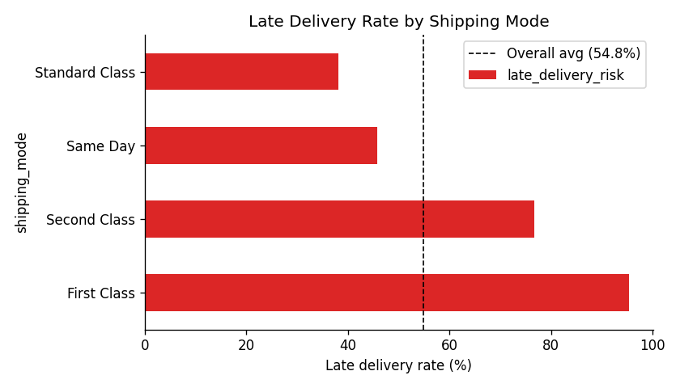
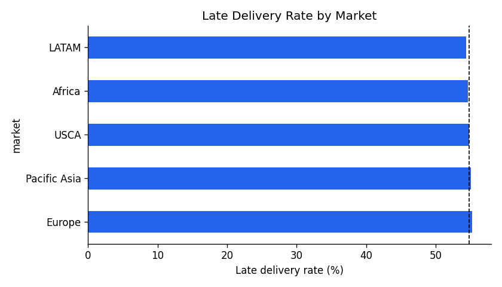
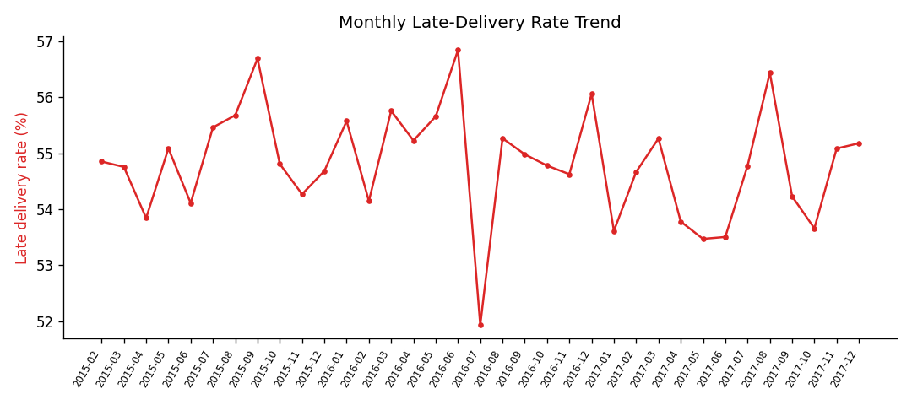
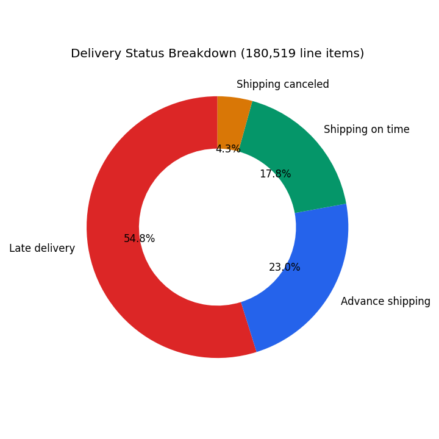
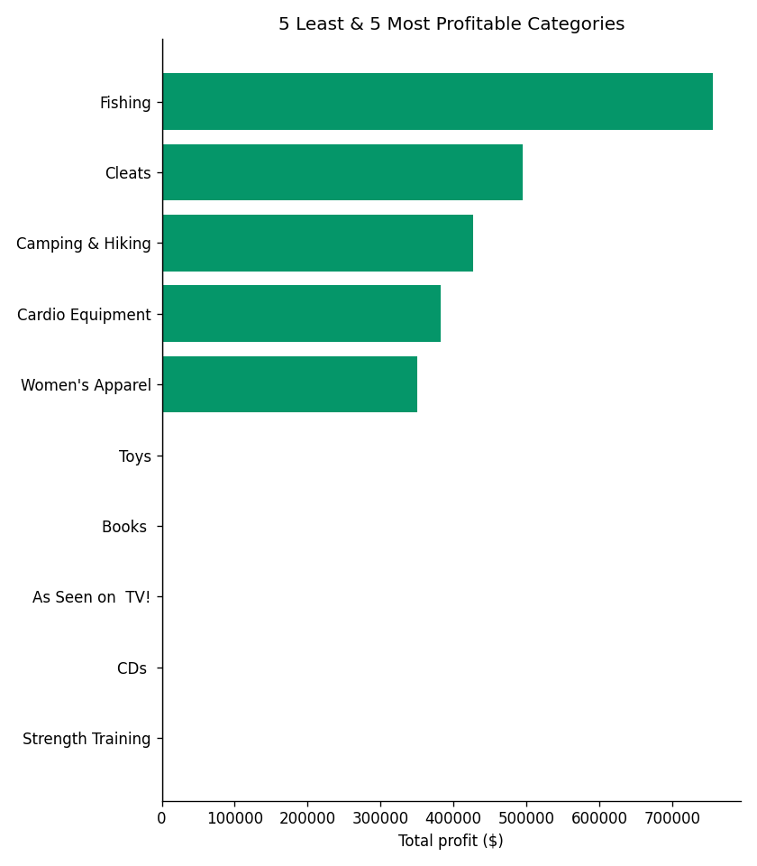
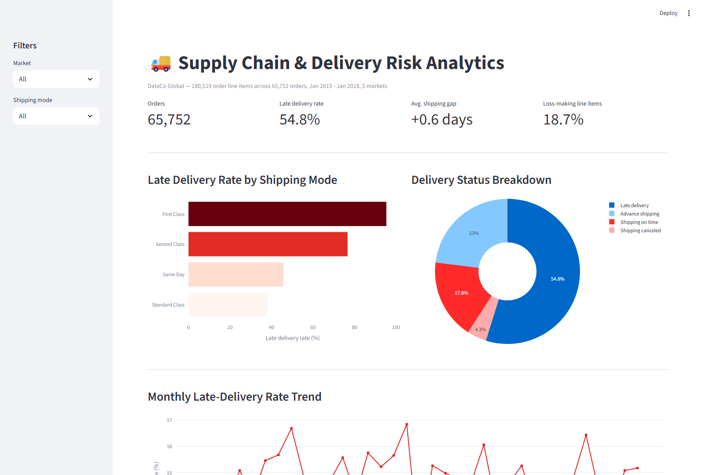

# Supply Chain & Delivery Risk Analytics

**Operations analytics case study** — delivery risk, fulfillment performance, and product profitability across 180,519 real order line items for a global retailer (DataCo).

## TL;DR

- **54.8% of all orders are delivered late** — more than half.
- **The cause isn't geography, it's shipping mode**: late-delivery rate is nearly flat across all 5 markets (54.3%–55.2%), but ranges from **38.1% (Standard Class) to 95.3% (First Class)** by shipping mode. The "premium" faster options are dramatically less reliable than the basic one.
- First Class is late *almost every time* but only by ~1 day on average (a predictable, small overrun); Second Class is late less often (76.6%) but by nearly 2 days when it happens — a rate problem and a severity problem, and they need different fixes.
- **18.7% of line items are sold at a loss.** Every product category is still net-profitable in aggregate, but a meaningful chunk of individual transactions actively lose money — worth flagging for pricing/discount review.



## Business Problem

A retailer promising "First Class" or "Same Day" shipping is making a customer-facing commitment — if that commitment is broken most of the time, it's actively worse for customer trust than not offering the option at all. This project answers three questions an operations/supply-chain analytics role is actually asked:

1. **Where is delivery risk actually coming from** — market, shipping mode, customer segment, or product? (delivery risk analysis)
2. **How large is the fulfillment gap, and is it improving or worsening over time?** (fulfillment performance)
3. **Which products/categories are profitable, and which are quietly losing money?** (profitability analysis)

## Data

[DataCo Smart Supply Chain](https://www.kaggle.com/datasets/shashwatwork/dataco-smart-supply-chain-for-big-data-analysis) (Kaggle) — 180,519 real order line items, 65,752 orders, Jan 2015 – Jan 2018, across 5 markets (LATAM, Europe, Pacific Asia, USCA, Africa).

See [`data/README.md`](data/README.md) for full column documentation, including **columns deliberately dropped for privacy** (unverifiable customer name/address fields) and known source-data quirks. Neither the raw file nor the cleaned 71MB CSV is committed — both regenerate via `python src/clean_data.py` after downloading the raw CSV (link above).

## Methodology

**Delivery risk** — `late_delivery_risk` (binary) and `delivery_status` (categorical) broken out by shipping mode, market, customer segment, and department, to isolate which dimension actually drives lateness rather than assuming it's geography.

**Fulfillment gap** — `shipping_days_actual - shipping_days_scheduled` per shipping mode, distinguishing *rate* of lateness from *severity* of lateness (a mode can be late often but by a little, or late rarely but by a lot — these need different operational fixes).

**Profitability** — revenue, profit, and margin by category, plus the specific products most responsible for losses vs. profit, using `Benefit per order` (kept, renamed `profit_per_order`) after confirming and removing its exact duplicate column (`Order Profit Per Order`).

## Key Findings

### 1. Shipping mode, not geography, drives late delivery



Late-delivery rate barely moves across markets (Europe 55.2%, Pacific Asia 55.0%, USCA 54.8%, Africa 54.6%, LATAM 54.4%) or customer segments (Home Office 55.1%, Consumer 54.8%, Corporate 54.7%) — under a 1-point spread in both cases. Shipping mode, by contrast, spans a 57-point range:

| Shipping Mode | Late Delivery Rate | Avg. Days Late vs. Scheduled |
|---|---|---|
| First Class | 95.3% | +1.0 day |
| Second Class | 76.6% | +2.0 days |
| Same Day | 45.7% | +0.5 days |
| Standard Class | 38.1% | ~0 days |

**Read on this**: First Class is a rate problem — it's almost always late, but predictably by about a day, suggesting the *scheduled* commitment itself is unrealistic rather than operations being erratic. Second Class is a severity problem — late less often, but by nearly 2 days when it slips, suggesting inconsistent handling rather than a bad promise. Fixing these needs different interventions: resetting the First Class SLA vs. investigating Second Class process variance.

### 2. Delivery outcomes are stable over time — this is a structural issue, not a one-off event



The late-delivery rate holds steady in a narrow 51.9%–56.8% band across the full 3-year window with no clear improving or worsening trend — this is a persistent structural problem in how delivery commitments are set, not a temporary operational blip tied to a particular month or season.

### 3. Delivery status breakdown



Beyond the binary late/not-late flag, 4.3% of line items (7,754) are shipped as "Shipping canceled" — a distinct failure mode from lateness that's worth tracking separately, since a cancelled shipment isn't a delay, it's a lost sale.

### 4. Profitability: healthy in aggregate, but with real losses underneath



Every product category remains net-profitable overall, but **18.7% of individual line items (33,784 of 180,519) are sold at a loss** — meaning aggregate category-level profit is masking a real chunk of loss-making transactions, most likely tied to discounting. Worth a follow-up analysis specifically on discount rate vs. profit margin, which this dataset supports but wasn't in scope here.

## Interactive Dashboard (Python / Streamlit)



Filter by market and shipping mode, explore delivery risk, the monthly trend, and category profitability live.

```bash
pip install -r requirements.txt
streamlit run dashboard/app.py
```

## Tech Stack

Python (pandas, NumPy) · Matplotlib · Plotly · Streamlit

## Repository Structure

```
supply-chain-inventory-risk-analytics/
├── README.md
├── LICENSE                MIT
├── requirements.txt
├── data/
│   ├── README.md           column documentation, PII exclusions, data-quality notes
│   ├── raw/                 (gitignored — see data/README.md for download link)
│   └── processed/          cleaned orders + all result tables (CSV)
├── src/
│   ├── clean_data.py       raw -> clean orders (drops PII, dedupes, standardises names)
│   └── analysis.py         delivery risk, fulfillment gap, profitability
├── dashboard/
│   └── app.py               Streamlit interactive dashboard
├── figures/                  chart PNGs used in this README
└── tests/                    sanity-check tests for the cleaning/analysis pipeline
```

## How to Reproduce

```bash
git clone https://github.com/nahid-hasan-lipu/supply-chain-inventory-risk-analytics.git
cd supply-chain-inventory-risk-analytics
pip install -r requirements.txt

# Download DataCoSupplyChainDataset.csv from the Kaggle link above into data/raw/, then:
python src/clean_data.py
python src/analysis.py
streamlit run dashboard/app.py
```

## Author

**Nahid Hasan Lipu** — [GitHub](https://github.com/nahid-hasan-lipu) · [LinkedIn](https://www.linkedin.com/in/nahid-hasan-lipu-922447355/)
